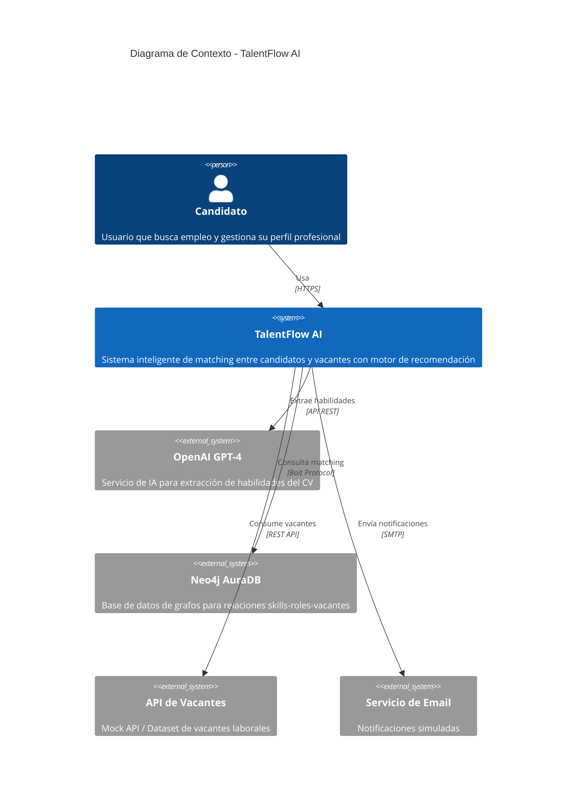

# Diagrama de Contexto - TalentFlow AI

## Descripción
El diagrama de contexto muestra la interacción entre TalentFlow AI y los actores externos del sistema.

## Diagrama de Contexto (C4 - Nivel 1)



## Diagrama Simplificado

```
                    ┌─────────────────┐
                    │    Candidato    │
                    │   (Usuario)     │
                    └────────┬────────┘
                             │
                             │ HTTPS
                             ▼
    ┌────────────────────────────────────────────────┐
    │              TalentFlow AI                      │
    │  ┌──────────────────────────────────────────┐  │
    │  │ • Gestión de perfiles                    │  │
    │  │ • Carga y análisis de CV                 │  │
    │  │ • Motor de recomendación                 │  │
    │  │ • Tablero de postulaciones               │  │
    │  │ • Autopostulación                        │  │
    │  └──────────────────────────────────────────┘  │
    └─────────┬──────────┬──────────┬───────────────┘
              │          │          │
              ▼          ▼          ▼
    ┌─────────────┐ ┌─────────┐ ┌──────────────┐
    │ OpenAI GPT  │ │ Neo4j   │ │ API Vacantes │
    │ (Extracción │ │ (Grafos │ │ (Dataset     │
    │  de skills) │ │ Skills) │ │  Mock)       │
    └─────────────┘ └─────────┘ └──────────────┘
```

## Actores y Sistemas

| Elemento | Tipo | Descripción |
|----------|------|-------------|
| Candidato | Actor Principal | Usuario final que busca empleo |
| TalentFlow AI | Sistema Principal | Plataforma de matching candidato-vacante |
| OpenAI GPT-4 | Sistema Externo | IA para procesamiento de lenguaje natural |
| Neo4j AuraDB | Sistema Externo | Base de datos de grafos para relaciones |
| API Vacantes | Sistema Externo | Fuente de datos de vacantes laborales |
| Servicio Email | Sistema Externo | Sistema de notificaciones |

## Flujos Principales

1. **Registro y Perfil**: Candidato → TalentFlow AI
2. **Análisis de CV**: TalentFlow AI → OpenAI GPT-4 → TalentFlow AI
3. **Matching**: TalentFlow AI → Neo4j → TalentFlow AI
4. **Vacantes**: TalentFlow AI → API Vacantes → TalentFlow AI
5. **Notificaciones**: TalentFlow AI → Candidato
