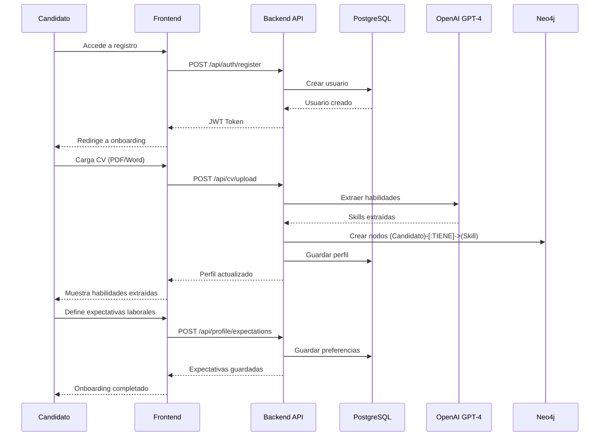
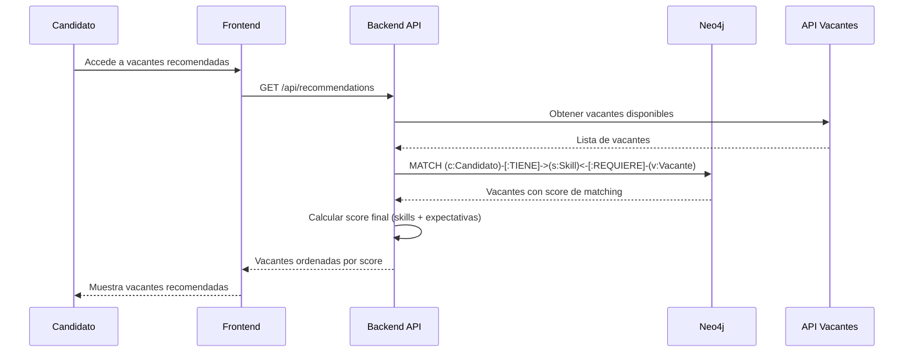
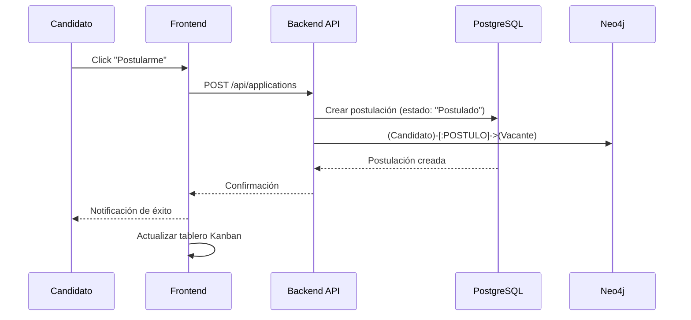
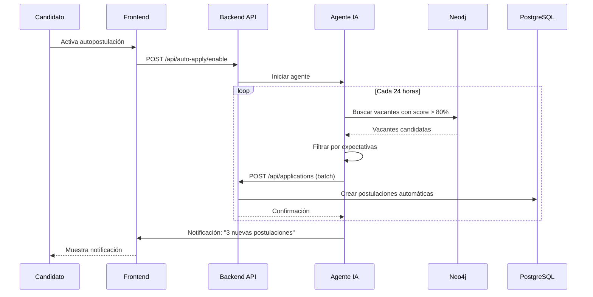
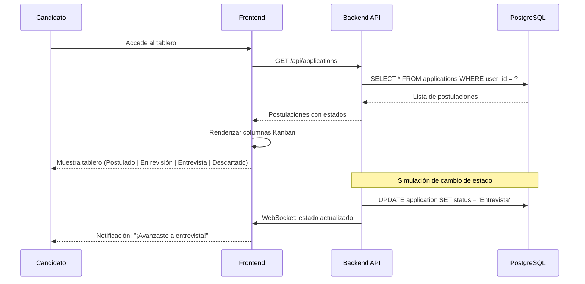
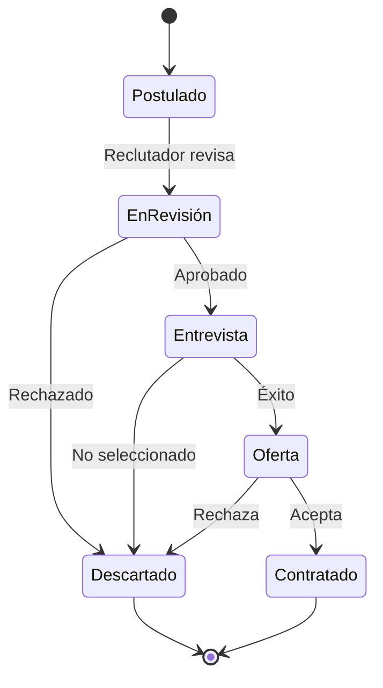

# Diagrama de Proceso de Interacción - TalentFlow AI

## Descripción
Este documento muestra los flujos de interacción principales del sistema TalentFlow AI.

---

## 1. Flujo de Registro y Onboarding



---

## 2. Flujo de Recomendación de Vacantes



---

## 3. Flujo de Postulación



---

## 4. Flujo de Autopostulación (Agente IA)



---

## 5. Flujo de Seguimiento (Tablero Kanban)



---

## Diagrama de Flujo General

```
┌─────────────────────────────────────────────────────────────────┐
│                        CANDIDATO                                 │
└─────────────────────────────┬───────────────────────────────────┘
                              │
        ┌─────────────────────┼─────────────────────┐
        ▼                     ▼                     ▼
┌──────────────┐    ┌──────────────┐    ┌──────────────┐
│  REGISTRO    │───▶│  ONBOARDING  │───▶│   VACANTES   │
│  (Auth JWT)  │    │  (CV + Exp)  │    │   (Match)    │
└──────────────┘    └──────────────┘    └──────────────┘
                                               │
                    ┌──────────────────────────┼──────────────────┐
                    ▼                          ▼                  ▼
           ┌──────────────┐          ┌──────────────┐    ┌──────────────┐
           │  POSTULACIÓN │          │ AUTO-APPLY   │    │   TABLERO    │
           │  (Manual)    │          │ (Agente IA)  │    │   (Kanban)   │
           └──────────────┘          └──────────────┘    └──────────────┘
                    │                          │                  │
                    └──────────────────────────┼──────────────────┘
                                               ▼
                                    ┌──────────────────┐
                                    │  NOTIFICACIONES  │
                                    │  (WebSocket)     │
                                    └──────────────────┘
```

---

## Estados de Postulación


